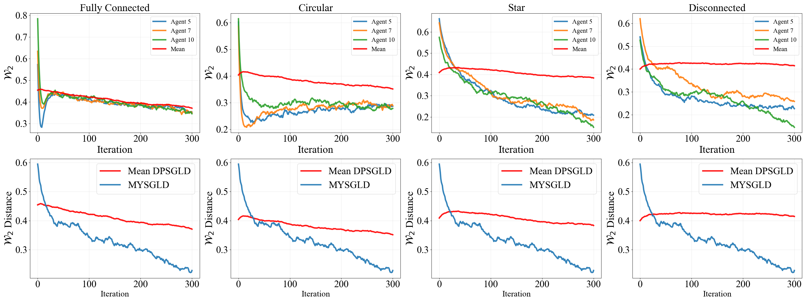
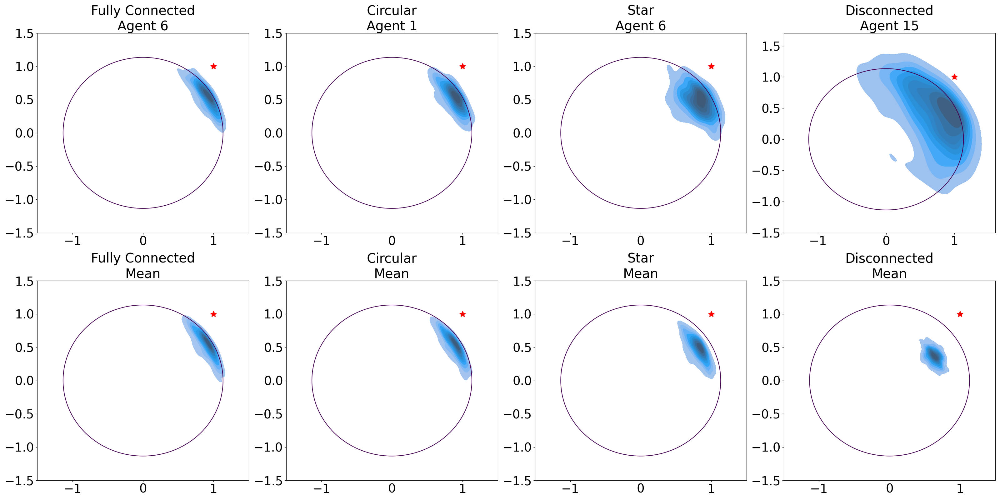
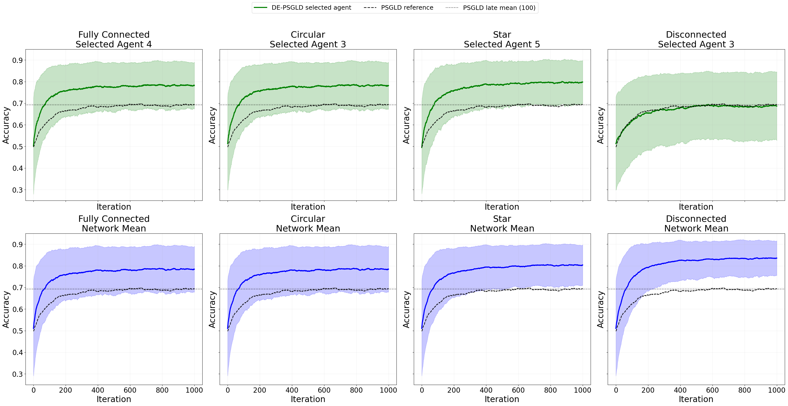

<!-- [](https://www.python.org/downloads/)
[](https://github.com/rispace/Decentralized-proximal-SGLD/stargazers)
[](https://github.com/rispace/rispace/Decentralized-proximal-SGLD/network/members)
[](https://github.com/rispace/Decentralized-proximal-SGLD/issues)
[](LICENSE) -->

# Decentralized Proximal Stochastic Gradient Langevin Dynamics (DE-PSGLD)

This repository contains the official implementation of the paper:

**Decentralized Proximal Stochastic Gradient Langevin Dynamics (DE-PSGLD)**

---

## Abstract

We propose Decentralized Proximal Stochastic Gradient Langevin Dynamics (DE-PSGLD), a decentralized Markov chain Monte Carlo (MCMC) algorithm for sampling from a log-concave probability distribution constrained to a convex domain. Constraints are enforced through a shared proximal regularization based on the Moreau–Yosida envelope, enabling unconstrained updates while preserving consistency with the target constrained posterior. We establish non-asymptotic convergence guarantees in the 2-Wasserstein distance for both individual agent iterates and their network averages. Our analysis shows that DE-PSGLD converges to a regularized Gibbs distribution and quantifies the bias introduced by the proximal approximation. We evaluate DE-PSGLD for different sampling problems on synthetic and real datasets. As the first decentralized approach for constrained domains, our algorithm exhibits fast posterior concentration and high predictive accuracy.

---

## Key Features

* Decentralized Langevin-based MCMC sampling
* Proximal (Moreau–Yosida) handling of constraints
* Support for multiple network topologies:

  * Fully connected
  * Circular
  * Star
  * Disconnected
* Implementations for:

  * Bayesian logistic regression
  * Bayesian linear regression
* Built-in evaluation tools:

  * Posterior visualization
  * Predictive accuracy

---

## Installation

[Download](https://anonymous.4open.science/r/Decentralized-proximal-SGLD-74E8/README.md) the repository from the anonymous.4open.science/r site and install dependencies:

```bash
pip install -r requirements.txt
```

---

## Reproducibility

All experiments from the paper can be reproduced using the provided notebooks.

### 1. Synthetic 1D Sampling

```bash
jupyter notebook experiments/synthetic1Dsampling.ipynb
```

### 2. Synthetic 2D Linear Regression

```bash
jupyter notebook experiments/synthetic2Dlinreg.ipynb
```

### 3. Wisconsin Breast Cancer Classification

```bash
jupyter notebook experiments/WisconsinBCclassificationSampling.ipynb
```

Each notebook:

* runs DE-PSGLD and baseline methods
* generates figures and performance metrics reported in the paper

---

## Datasets

### Wisconsin Breast Cancer Dataset

* Source: UCI Machine Learning Repository
* Accessed via: `sklearn.datasets`

### Synthetic Data

* Generated within the notebooks for controlled experiments

---

## Code Structure

```
.
├── README.md
├── requirements.txt
├── samplers
│   ├── DE-PSGLD.py      # Main decentralized sampler
│   └── mysgld.py        # Centralized SGLD baseline
├── utils
│   ├── networks.py      # Network topology & mixing matrices
│   ├── helpers.py       # Gradients, priors, utilities
│   └── evaluation.py    # Metrics and performance evaluation
└── experiments
    ├── synthetic1Dsampling.ipynb
    ├── synthetic2Dlinreg.ipynb
    ├── WisconsinBCclassificationSampling.ipynb
    └── images
```

---

## Method Overview

DE-PSGLD combines:

* **Decentralized consensus dynamics** for multi-agent learning
* **Stochastic gradient Langevin updates** for posterior sampling
* **Proximal regularization** to enforce constraints

The algorithm enables scalable Bayesian inference in distributed settings while maintaining theoretical guarantees in Wasserstein distance.

---

## Example Results

### 1D Sampling



### 2D Linear Regression

  

### Logistic Regression  



---

## Environment

Tested with:

* Python 3.10
* NumPy
* SciPy
* scikit-learn
* Jupyter Notebook

---

## Citation

Anonymous submission under review at NeurIPS 2026.


---

## Notes

* This repository mirrors the anonymized submission used for NeurIPS review.
* No identifying information about the authors is included.


